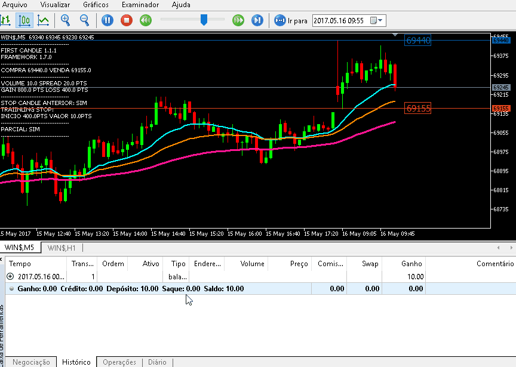

# first-candle.bad-robot

Este setup é um classico, consiste em pegar o primeiro candle de hora do dia e marcar sua maxima para entrar na compra caso seja rompida e 
sua minima para o mesmo porem na venda. Porem com esse robot é possivel determinar qualquer tempo grafico, não entendeu?
Que tal entrar no rompimento da maxima do primeiro candle de 5min? é possivel! basta configurar a sua estrategia.

Quer utilizar o robô e não sabe como obter o executável apenas com o código-fonte? Entre em contato através do email erlon.efs@gmail.com para fornece-lo. E bons trades!

